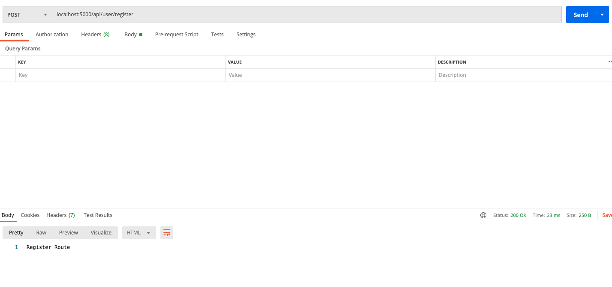
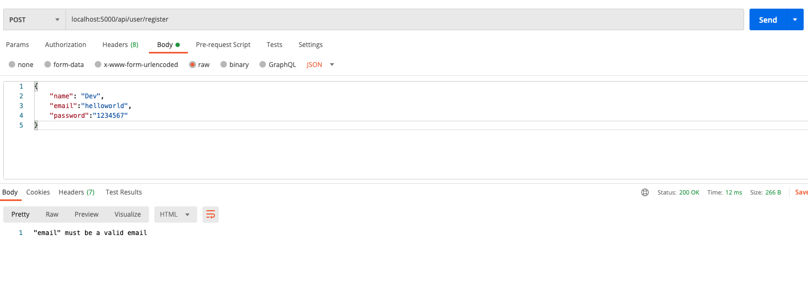
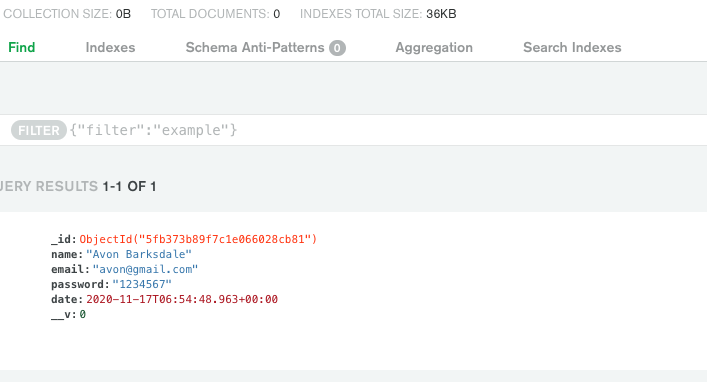

### Node Js ? JWT ?
Tailwind is a highly customizable CSS framework with which you can quickly create your own web pages and components. Different classes exist and we can create our own classes for avoid repeating code.

#### Install Tailwind CSS
Lets initialize our project with these command
```css
npm init -y
npm install express
npm install --save-dev nodemon
```
On modifie notre *package.json:* afin qu'à chaque modification notre serveur se relance tout seul en faisant *npm start* Nodemon index.js sera appellé à chaque sauvegarde du fichier

```js
"scripts": {
    "test": "echo \"Error: no test specified\" && exit 1",
    "start": "nodemon index.js"
  },
```
Ici on dans le chemin */register* en POST on envoie juste une string *'Register Route'* et on l'exporte pour l'utiliser ailleurs.

*routes/auth.js:*
```js
const router = require('express').Router();

router.post('/register', (req, res) => {
    res.send('Register Route');
});

module.exports = router;

```
Dans notre *index.js* on appelle mongoose afin de connecter notre base de données, dotenv qui nous sert à garder secret certaines variables comme les identifiants de connexion à la base de données ainsi que le cors afin de pouvoir faire nos requêtes HTTP.

*index.js:*
```js
const express = require('express');
const app = express();
const dotenv = require('dotenv');
const mongoose = require('mongoose');
const cors = require('cors');

//Import Routes
const authRouthe = require('./routes/auth');

dotenv.config();

//Connect Db
mongoose.connect(
    process.env.DB_CONNECT,
{
    useNewUrlParser: true,
    useUnifiedTopology: true,
    useCreateIndex: true,
    autoIndex: true,
  },
() => console.log('DB connected '));

// Middleware
app.use(express.urlencoded({ extended: true }));
app.use(express.json());
app.use(cors());

//Routes Middlewares
app.use('/api/user', authRoute);

app.listen(5000, () => console.log('Server is here'));

```


If you run *npm start* you will see in the terminal *'Server is here' 'DB connected'* and open postman with the same route like image bellow you should see in body *'Register Route'*

<div className="Image__Small">
  
</div>

Maintenat nous allons modéliser la facon dont nos Users seront sauvegardés en base de données 

*models/User.js:*
```js
const mongoose = require('mongoose');

const userSchema = new mongoose.Schema({
    name: {
        type: String,
        required: true,
        min: 3,
        max: 100,
    },
    email: {
        type: String,
        required: true,
        max: 100,
        min: 6
    },
    password: {
        type: String,
        required: true,
        max: 1024,
        min: 6
    },
    date: {
        type: Date,
        default: Date.now
    }
});

module.exports = mongoose.model('User', userSchema);

```

Une fois nos User modéliser on va créer un système de validation pour controler ce que le Client va saisir, grace à la librairie @hapi/JOI

*routes/validation.js:*
```js
const mongoose = require('mongoose');

const userSchema = new mongoose.Schema({
    name: {
        type: String,
        required: true,
        min: 3,
        max: 100,
    },
    email: {
        type: String,
        required: true,
        max: 100,
        min: 6
    },
    password: {
        type: String,
        required: true,
        max: 1024,
        min: 6
    },
    date: {
        type: Date,
        default: Date.now
    }
});

module.exports = mongoose.model('User', userSchema);


```

Maintenant on peut modifier notre fichier *routes/auth.js* pour mettre en place notre sytème d'inscription pour la route */register* en y ajoutant nos fonction de validation

```js
const router = require('express').Router();
const User = require('../models/User');
const {registerValidation} = require('../routes/validation');


router.post('/register', async (req,res) => {
     // Validate Data before we create user
    const {error} = registerValidation(req.body);
   
    if (error) return res.status(400).send(error.details[0].message);

   const user = new User({
      name: req.body.name,
      email: req.body.email,
      password: req.body.password 
    });
    try {
        const savedUser = await user.save();
        res.status(201).send(savedUser);
    } catch (err) {
        res.status(400).send(err);
    } 
});

module.exports = router;

```
Ci-dessous nous avons une erreur de validation car le type du champs email n'est pas un email il manque le *@*, on récupere pour chaque erreur le message qui va avec pour l'afficher,
<div className="Image__Small">
  
</div>

Dans le cas ou aucune erreur de validation n'est detectée on enrengistre notre User dans la base de données.

<div className="Image__Small">
  
</div>